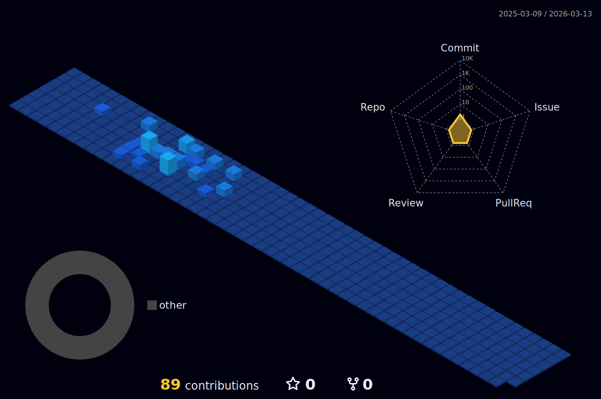

  

    

         
        
    

     
    

<h1 align="center">
    

      
    

    

        
        
        
    

</h1>

---

<h1 align="center">
    
</h1>

---

<h1 align="left"> :man_technologist: About Me : </h1>
    
I’m python Software Engineer from Russia

    <ul align="left">
      <li>:telescope: I’m working python Software Engineer and contributing backend for building web applications.</li>
      <li>:zap: In my free time, I solve problems on LeetCode, read technical articles, and study new technologies.</li>
    </ul>

---

<h1 align="left"> My skills: :hammer_and_wrench:</h1>

    <h3 align="left">Languages and frameworks: :bulb:</h3>

| Languages                                                                  | Frameworks                                                                                                                                                                                                                                       | Testing  |
|----------------------------------------------------------------------------|--------------------------------------------------------------------------------------------------------------------------------------------------------------------------------------------------------------------------------------------------|----------|
|  |        |  |

### 🗄️ Databases & Storages

| Relational        | NoSQL / Search           | ORM / Tools               |
|-------------------|--------------------------|---------------------------|
|  |     |     |
|                   |  |                           |

### 🧰 Dev & Messaging

| Category                    | Tools                                                                                                         |
|-----------------------------|---------------------------------------------------------------------------------------------------------------|
| **Containers & VCS**        |           |
| **CI/CD & Packaging**       |                                  |
| **Messaging & Streaming**   |     |
| **API & Documentation**     |        |
| **Monitoring & Logging**    |     |
| **Project Management**      |                                         |

### 🎨 Frontend & Markdown

| Markup & Styles | Documentation |
|-----------------|---------------|
|     |  |

### 🖥️ Operating Systems

| Primary               |
|-----------------------|
|           |

---

<h1> :fire: My Stats :</h1>
<!-- 

 -->

    
    

  

    

